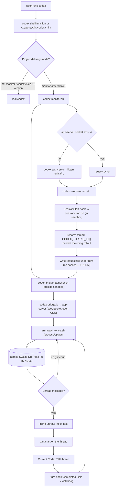

# Legacy Codex Monitor Bridge

> Current Codex monitor delivery follows the same contract as Claude Code:
> `SessionStart` emits an `AGMSG-DIRECTIVE`, the host starts `watch.sh` as a
> persistent Monitor task, and `watch.sh` streams SQLite message rows into the
> session. This page describes the old app-server bridge retained only for
> legacy compatibility/debugging.

Before Codex exposed Monitor tools, agmsg approximated the same experience by
launching Codex through an app-server bridge.

> ⚠️ **Experimental beta — read before enabling.** This changes how Codex starts.
> Enabling monitor mode prints a shell function that makes `codex` route through
> agmsg's monitor shim in your interactive shell. In monitor-mode projects the
> shim re-routes interactive launches through an app-server bridge; everywhere
> else it passes straight through. **Only enable this if you are comfortable with
> the `codex` command being intercepted in that shell.** It also depends on Codex
> app-server behavior and may break as Codex changes. Known rough edges:
> enabling monitor takes effect only after you **restart Codex and send your
> first message** — the SessionStart hook fires on the first turn, not the
> moment Codex opens, so the bridge is absent until you interact once; an
> already-running session stays unmonitored until you restart it (#151); the
> bridge is not torn down when you close the TUI (orphans linger until reboot
> or `mode off`/manual kill, see #149); and only one Codex identity per project
> is supported (#150).

## Quick Start

Enable monitor mode in a project:

```bash
~/.agents/skills/agmsg/scripts/delivery.sh set monitor codex "$PWD"
```

The command:

1. Enables agmsg's Codex SessionStart/SessionEnd hooks for the project.
2. Prints a shell function that routes interactive `codex` launches through the
   monitor shim.

The Codex sandbox must allow writes to the installed skill's runtime state:

```text
~/.agents/skills/<cmd>/db
~/.agents/skills/<cmd>/teams
~/.agents/skills/<cmd>/run
```

`install.sh` and `install.sh --update` add these writable roots to
`~/.codex/config.toml` when that file exists.

Add the printed function to your shell profile. It looks like:

```bash
codex() {
  ~/.agents/skills/agmsg/scripts/drivers/types/codex/codex-shim.sh "$@"
}
```

Restart the shell, then launch Codex normally:

```bash
codex
```

In monitor-mode projects, the function routes interactive Codex launches through
the bridge. Outside monitor-mode projects, it passes through to the real Codex.

## Optional PATH Shim

If you prefer the previous global PATH shim setup, install it explicitly:

```bash
~/.agents/skills/agmsg/scripts/drivers/types/codex/codex-shim-install.sh install
```

Then put `~/.agents/bin` before the real Codex binary on PATH:

```bash
export PATH="$HOME/.agents/bin:$PATH"
```

If `~/.agents/bin/codex` already exists and is not the agmsg shim, agmsg leaves
it untouched. You can either move that command aside and run the install command
again, or launch monitor sessions explicitly:

```bash
~/.agents/skills/agmsg/scripts/drivers/types/codex/codex-monitor.sh
```

For custom command names, replace `agmsg` with the installed skill name:

```bash
~/.agents/skills/<cmd>/scripts/drivers/types/codex/codex-monitor.sh
```

## What The Shim Does

The shell function and optional PATH shim only wrap interactive Codex TUI
launches:

```bash
codex
codex resume
codex "fix this bug"
```

Noninteractive subcommands pass through to the real Codex binary:

```bash
codex exec ...
codex app-server ...
codex login
codex logout
```

The shim also passes through when the current project is not in Codex monitor
mode.

## Bridge Mechanics

`codex-monitor.sh` starts (or reuses) an agmsg-managed Codex app-server socket
under `~/.agents/skills/<cmd>/run/`, starts the out-of-sandbox bridge launcher,
and then connects the Codex TUI to that socket with `--remote`.

Codex fires the SessionStart hook on the session's **first turn** (the first
message you send), not the moment the TUI opens — so the bridge does not exist
until you interact once after a restart.

The SessionStart hook is designed to **not** start the bridge directly — a
hook-launched process was observed to run inside the Codex sandbox and fail to
connect to the unix socket (EPERM). Instead:

> Note: this EPERM-avoidance design (the launcher + request-file rendezvous
> below) is under review — in practice the hook has been seen to launch a
> detached bridge directly and connect fine, suggesting the launcher layer may
> be redundant. See #153.

1. `session-start.sh` (the hook) resolves the thread id — `CODEX_THREAD_ID` when
   set, otherwise the newest Codex rollout whose `session_meta` cwd matches the
   project (fresh / `codex exec` sessions never export `CODEX_THREAD_ID`) — and
   writes a **request file** under `run/` (it never touches the socket).
2. `codex-bridge-launcher.sh`, started by `codex-monitor.sh` **outside** the
   sandbox, reads the request file and starts `codex-bridge.js`.
3. The bridge connects to the same app-server over **WebSocket-over-UDS**,
   resumes the thread, and arms `watch-once.sh` via the app-server `process/spawn`
   API (which polls the agmsg DB for unread rows, `read_at IS NULL`).
4. On an unread message it inlines the text into a `turn/start` on that thread —
   surfacing it in the live Codex TUI — then re-arms after the turn ends.

Turns are serialized (one per thread): a message that arrives while a turn is
running stays unread and is delivered after the turn completes. The turn ends
via `turn/completed`, a `thread/status` idle, or a watchdog (the real app-server
does not reliably send `turn/completed`); only then is the next `watch-once`
armed. If a turn does not consume the unread message, the same `max_id` reappears
and the bridge stops instead of looping.



## Worker Guardrails

> ⚠️ **Never poll agmsg by launching a full Codex/Claude session on a short
> interval.** Use a shell-only gate first and start the heavy agent only when
> there is actually something to handle.

### Case study: empty-poll OOM (#163)

A user wired an autonomous worker as a `cron` job (`FREQ=MINUTELY;INTERVAL=3`)
that launched a **full Codex session every 3 minutes** to check the agmsg inbox,
git state, GitHub issues, and so on. The approval/away-window had already
expired, so almost every tick returned `No new messages.` — yet each tick still
spun up a complete Codex session with a long prompt and project context.

About 60 Codex sessions were created in under three hours. Codex Desktop keeps a
transcript / trace / tool-output / local log DB per session, so the no-op runs
accumulated: `~/.codex/logs_2.sqlite` grew to ~2.2 GB (plus ~1.1 GB WAL), Codex
memory climbed to ~158 GB, and macOS hit a Low-Memory / jetsam state that forced
a hard restart.

This is **not** an agmsg transport or SQLite bug. The root cause is the worker
shape: a short-interval scheduler that runs a heavyweight agent as the poller,
with no cheap no-op path, so empty inboxes still pay the full cost — and Codex
Desktop's per-session UI/log accumulation amplifies it.

### Gate with `watch-once.sh`, launch the agent only on a hit

agmsg already ships the cheap gate this needs. `watch-once.sh` is a shell-only,
one-shot inbox oracle — no agent, no Codex turn. It is the same primitive the
Codex monitor bridge uses (see [Bridge Mechanics](#bridge-mechanics)) to avoid
starting a turn on an empty inbox.

```text
exit 0  unread inbound exists   (prints: status=pending count=<n> max_id=<id>)
exit 2  nothing pending          (prints: status=timeout)
exit 1  configuration / runtime error
```

Two-stage worker — the shell gate decides whether the expensive agent runs:

```bash
#!/usr/bin/env bash
set -euo pipefail
SKILL=~/.agents/skills/agmsg/scripts
PROJECT="/path/to/project"

# 1. Cheap shell-only check. --timeout 0 makes it a single poll, then exit.
#    --team/--name scope the gate to one identity (matches the single-flight
#    key below, and disambiguates when the same agent name exists in two teams).
if "$SKILL/watch-once.sh" "$PROJECT" codex --team myteam --name myagent --timeout 0; then
  # 2. Unread exists — only now pay for a full Codex/Claude session.
  codex exec "Handle the new agmsg messages for this project."
fi
# exit 2 (nothing pending) falls through and the worker ends cheaply.
```

### Defense in depth

For an unattended worker, layer these on top of the gate:

- **Single-flight lock per `(team, agent)`** so overlapping ticks don't stack
  concurrent agents:
  ```bash
  exec 9>"/tmp/agmsg-worker.myteam.myagent.lock"
  flock -n 9 || exit 0   # another tick is still running; skip this one
  ```
- **Approval / away-window expiry check before launch.** If the worker is only
  authorized for a window, verify it hasn't expired *before* starting the agent,
  and disable the worker (or exit) once it has — don't leave it `ACTIVE` past its
  window.
- **Exponential backoff on repeated no-ops.** After N consecutive empty gates,
  widen the interval so an idle worker stops hammering.
- **Max-run cap.** Bound total runs (e.g. `COUNT` for `cron`) and prefer
  intervals measured in minutes, not seconds.
- **Codex Desktop note.** Codex Desktop retains transcript / tool-output / trace
  per session and a local log DB (`~/.codex/logs_*.sqlite`). Even short no-op
  sessions accumulate there, so a high-frequency spawner is far heavier than the
  per-run wall-clock suggests. The shell gate above avoids creating those
  sessions at all on empty ticks.

### Emergency stop (runaway worker)

1. Make the worker inactive / unschedule the `cron` job so it stops spawning.
2. Back off delivery: `delivery.sh set turn codex "$PROJECT"` (or `off`) to stop
   monitor-driven launches.
3. Kill stale monitors / spawned sessions and any orphaned bridge
   (`mode off` tears the bridge down; see #149).
4. Inspect Codex Desktop log-DB bloat: `~/.codex/logs_*.sqlite` and its WAL.

## Related Details

- [Delivery modes](../README.md#delivery-modes)
- [Codex bridge implementation](../scripts/drivers/types/codex/codex-bridge.js)
- [Monitor launcher](../scripts/drivers/types/codex/codex-monitor.sh)
- [Codex shim](../scripts/drivers/types/codex/codex-shim.sh)
