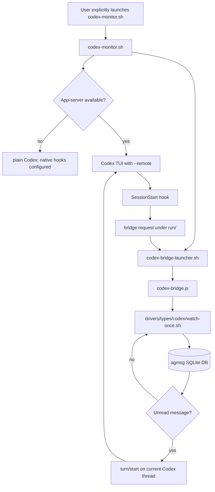

# Codex Legacy Bridge

This page documents agmsg's optional Codex app-server bridge compatibility
path. The filename is kept for existing links, but this is not the normal Codex
monitor setup anymore.

Normal Codex `monitor` mode uses Codex's native Monitor integration. It does not
install or require a `codex` command shim, and it does not require `~/.agents/bin`
to come before the real Codex binary on `PATH`.

## Normal Codex Monitor Mode

Use the standard mode command:

```bash
~/.agents/skills/agmsg/scripts/delivery.sh set monitor codex "$PWD"
```

or, from the skill command:

```text
$agmsg mode monitor
```

The command:

1. Writes the Codex SessionStart/SessionEnd hooks for the current project.
2. Stops stale legacy bridge processes for the project, if any exist.
3. Emits an `AGMSG-DIRECTIVE` so the current Monitor-capable session can start
   the watcher immediately.

Future Codex sessions start `watch.sh` from the SessionStart hook. If the
current session does not pick up the new hook immediately, start a fresh Codex
session.

Codex currently supports `monitor`, `turn`, and `off`; it does not support
`both`.

## Sandbox Writes

Codex may run shell commands in a workspace-write sandbox. agmsg stores the
message DB, team registry, and watcher runtime state under the installed skill
directory, which is usually outside the project workspace.

Allow these writable roots when Codex sandboxing is enabled:

```text
~/.agents/skills/<cmd>/db
~/.agents/skills/<cmd>/teams
~/.agents/skills/<cmd>/run
```

`install.sh` and `install.sh --update` add those roots to
`~/.codex/config.toml` when that file exists.

## When To Use The Legacy Bridge

Use the legacy bridge only when you intentionally need the older app-server
compatibility path, for example:

- you are running a Codex build or wrapper without usable native Monitor
  support
- you are debugging the historical app-server bridge
- you need to reproduce behavior from an older agmsg installation

Do not use the bridge as the standard setup for `delivery.sh set monitor codex`.

## Explicit Wrapper

Launch a bridge-backed Codex session explicitly:

```bash
~/.agents/skills/agmsg/scripts/drivers/types/codex/codex-monitor.sh
```

For custom command names, replace `agmsg` with the installed skill name:

```bash
~/.agents/skills/<cmd>/scripts/drivers/types/codex/codex-monitor.sh
```

The wrapper sets `AGMSG_CODEX_BRIDGE=1`, enables Codex `monitor` mode for the
project, starts or reuses an agmsg-managed Codex app-server, starts the bridge
launcher, then execs Codex with `--remote`.

If the app-server path is unavailable, the wrapper fails open: it configures the
normal native Monitor hooks, launches plain Codex, and prints that the legacy
bridge is unavailable. If that Codex build also lacks native Monitor support,
messages still queue and can be read manually with `$agmsg`.

## Optional Shim

The shim is only for users who explicitly want interactive `codex` launches in
monitor-mode projects to route through `codex-monitor.sh`.

Install it deliberately:

```bash
~/.agents/skills/<cmd>/scripts/drivers/types/codex/codex-shim-install.sh install
```

Then put `~/.agents/bin` before the real Codex binary on `PATH`.

Remove it:

```bash
~/.agents/skills/<cmd>/scripts/drivers/types/codex/codex-shim-install.sh remove
```

Bypass it for one launch:

```bash
AGMSG_CODEX_SHIM_DISABLE=1 codex
```

The shim passes noninteractive subcommands through to the real Codex binary:

```bash
codex exec ...
codex app-server ...
codex login
codex logout
```

It also passes through when the current project is not in Codex `monitor` mode.

## Bridge Mechanics

The legacy bridge path uses the Codex app-server API instead of the native
Monitor watcher path:

1. `codex-monitor.sh` starts or reuses an app-server on a loopback `ws://` port.
2. It exports `AGMSG_CODEX_BRIDGE=1`,
   `AGMSG_CODEX_BRIDGE_APP_SERVER=<url>`, and
   `AGMSG_CODEX_BRIDGE_LAUNCHER=1`.
3. It runs `delivery.sh set monitor codex "$PROJECT"` in bridge mode.
4. `codex-bridge-launcher.sh` waits for a SessionStart handoff request.
5. The Codex SessionStart plug resolves the current thread and writes that
   request under `run/`.
6. `codex-bridge.js` connects to the app-server, resumes the thread, polls for
   unread agmsg rows with `drivers/types/codex/watch-once.sh`, and starts a
   Codex turn when a message arrives.

Turns are serialized per thread. A message that arrives while a turn is running
stays unread and is delivered after the turn completes.



Known limits of the legacy path:

- it depends on Codex app-server behavior that may change
- only one Codex identity per project is supported by the bridge path
- stale bridge or app-server processes may need `mode off` or manual cleanup

## Worker Guardrails

Never poll agmsg by launching a full Codex or Claude session on a short
interval. Use a shell-only gate first and start a heavyweight agent only when
there is actually something to handle.

For Codex bridge-style workers, the cheap gate is:

```text
~/.agents/skills/<cmd>/scripts/drivers/types/codex/watch-once.sh
```

Exit codes:

```text
exit 0  unread inbound exists   (prints: status=pending count=<n> max_id=<id>)
exit 2  nothing pending         (prints: status=timeout)
exit 1  configuration or runtime error
```

Example:

```bash
#!/usr/bin/env bash
set -euo pipefail
SKILL=~/.agents/skills/agmsg/scripts
PROJECT="/path/to/project"

if "$SKILL/drivers/types/codex/watch-once.sh" "$PROJECT" codex \
  --team myteam --name myagent --timeout 0; then
  codex exec "Handle the new agmsg messages for this project."
fi
```

For unattended workers, add a single-flight lock per `(team, agent)`, check any
approval or away-window expiry before launching an agent, back off repeated
empty polls, and cap total runs.

## Related Details

- [Delivery modes](../README.md#delivery-modes)
- [Codex bridge implementation](../scripts/drivers/types/codex/codex-bridge.js)
- [Legacy bridge launcher](../scripts/drivers/types/codex/codex-monitor.sh)
- [Optional Codex shim](../scripts/drivers/types/codex/codex-shim.sh)
